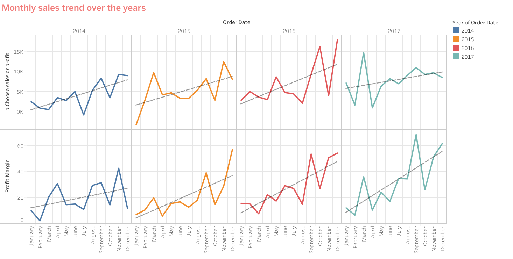
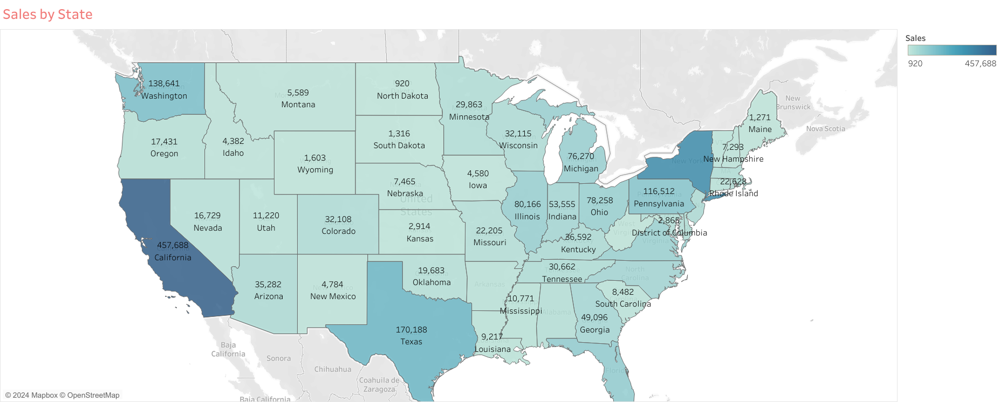
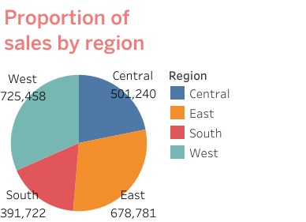
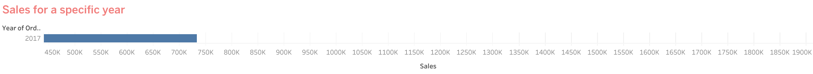
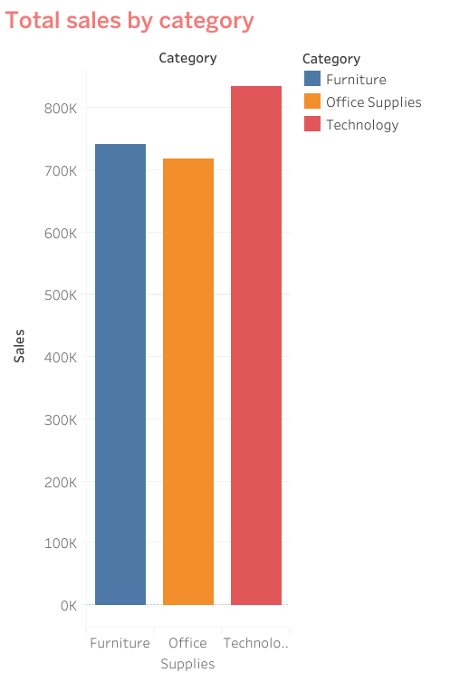
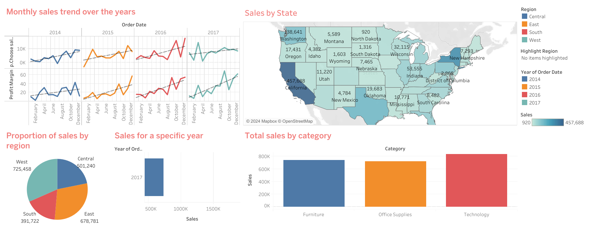

# SalesData-Analysis-using-Tableau

## Description
This project is a comprehensive sales analysis dashboard created using Tableau. It provides insights into sales trends, regional performance, and product category performance over multiple years. The visualizations are designed to help businesses understand their sales data better and make informed decisions.

## Objectives
- **Analyze Monthly Sales Trends**: Understand how sales have changed over time on a monthly basis.
- **Evaluate Sales by State**: Identify which states contribute the most to overall sales.
- **Regional Sales Distribution**: Assess the proportion of sales across different regions.
- **Annual Sales Performance**: Compare sales performance for specific years.
- **Category-Wise Sales**: Analyze sales distribution across different product categories.

## Data Description
The dataset used in this project is the Sample - Superstore dataset provided by Tableau. It includes sales data from a fictional office supplies store, covering various aspects such as order date, sales amount, state, region, and product category.

## Visualizations

### Monthly Sales Trend Over the Years

**Description**: This visualization shows the trend of monthly sales over the years, indicating the overall sales growth.

### Sales by State

**Description**: This map illustrates the sales distribution across different states, highlighting the regions with the highest sales.

### Proportion of Sales by Region

**Description**: This pie chart depicts the proportion of sales in various regions, providing insight into regional sales distribution.

### Sales for a Specific Year

**Description**: This bar chart shows the total sales for a particular year, offering a clear comparison of yearly sales.

### Total Sales by Category

**Description**: This bar chart compares the total sales across different product categories, highlighting the most profitable categories.

### Dashboard of the Visualizations

## Calculated Fields and Parameters
- **Profit Margin**: A calculated field to determine the profit margin using the formula `[Profit] / [Sales]`.
- **Parameter Control**: A parameter to switch between different measures (e.g., Sales and Profit) on the bar chart.

## Interactive Dashboard
The dashboard includes interactive elements that allow users to filter charts based on their selections. Actions have been added to enable interactivity and enhance the user experience.
